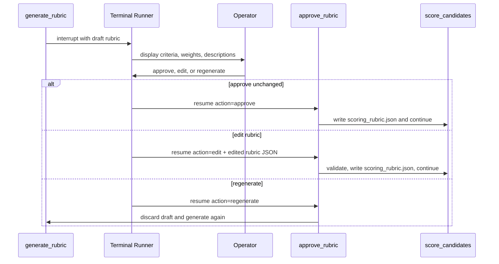
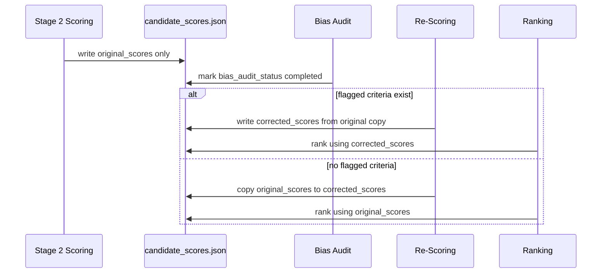
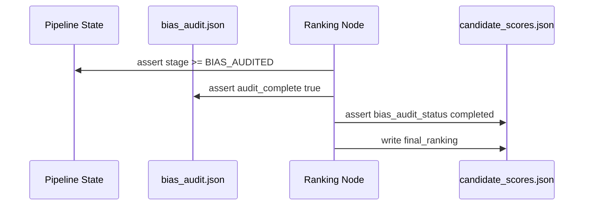

# Scoring Preservation and LLM Logging Implementation Spec

## Purpose

This implementation spec closes the requirements gap around criterion-level score preservation and LLM call logging for the recruitment pipeline described in `docs/langgraph_recruitment_pipeline_spec.md`.

The implementation must prove that original Stage 2 scoring is never overwritten, corrected scoring is stored separately, final ranking uses corrected scores when bias re-scoring occurs, and every LLM call is logged with enough metadata to validate stage separation and anonymisation.

This is a standalone implementation spec. Do not merge these requirements back into the main LangGraph spec; link to this document from implementation tasks when needed.

---

## Required Commands

The repository must expose both a pipeline run command and a validation command in setup instructions.

| Command | Required | Purpose |
|---|---:|---|
| `python -m risk_auditor.run` or equivalent | Yes | Runs the staged recruitment pipeline from disk inputs. |
| `make validate` | Preferred | Executes the full artifact and ordering validation suite. |
| `python validate.py` | Required fallback | Runs the same validation checks without requiring Make. |

At least one of `make validate` or `python validate.py` must work from a clean checkout after dependencies are installed. If `make validate` is provided, it must delegate to `python validate.py` or run an equivalent validation suite.

Validation must not rely on static, precomputed artifacts. It must validate the artifacts generated by the latest pipeline run and fail clearly when required artifacts are missing.

---

## Step 0: Dynamic Terminal Human-in-the-Loop Rubric Checkpoint

**Files**:

- terminal runner module
- rubric approval node
- `scoring_rubric.json`
- `llm_calls.jsonl`

The pipeline must provide an interactive terminal checkpoint after draft rubric generation and before candidate scoring. Candidate scoring must not begin until the operator approves or edits the rubric.



### Terminal Interaction Requirements

The terminal runner must show a dynamic prompt with these choices:

```text
Rubric approval checkpoint

[1] Approve rubric unchanged
[2] Edit rubric JSON
[3] Reject and regenerate rubric
Select action:
```

For approval:

- write the approved draft to `scoring_rubric.json`.
- set stage to `RUBRIC_APPROVED`.
- continue to candidate scoring.

For editing:

- accept edited criterion names, descriptions, and weights.
- validate exactly 6 criteria.
- validate every criterion has a name, weight, `0-10` scale, and one-sentence ten-point description.
- validate weights sum to `1.0` within tolerance.
- write only the edited approved rubric to `scoring_rubric.json`.
- continue to candidate scoring.

For regeneration:

- do not write `scoring_rubric.json`.
- do not score candidates.
- route back to rubric generation and produce a fresh draft.

### HITL Evidence Requirements

The implementation must leave terminal output or logs showing:

- the rubric approval checkpoint was reached.
- which operator action was chosen: approve, edit, or regenerate.
- candidate scoring started only after `scoring_rubric.json` was approved.

Do not append an LLM call record for the human approval action itself unless the implementation makes an additional LLM call during approval. The rubric generation LLM call remains logged as `RUBRIC_GENERATED`.

---

## Step 1: Preserve Original and Corrected Criterion Scores

**Files**:

- `candidate_scores.json`
- `scoring_rubric.json`
- pipeline scoring and re-scoring modules
- `validate.py`



### Required `candidate_scores.json` Shape

```json
{
  "approved_rubric_reference": "scoring_rubric.json",
  "rubric_hash": "sha256 of approved scoring_rubric.json",
  "original_scores": [
    {
      "candidate_id": "C1",
      "criteria": [
        {
          "criterion_name": "string",
          "score": 8.0,
          "weighted_score": 1.6,
          "rationale": "one sentence rationale"
        }
      ],
      "total_weighted_score": 8.0
    }
  ],
  "bias_audit_status": "not_started | completed",
  "flagged_criteria": [],
  "corrected_scores": [],
  "score_deltas": [],
  "scores_changed": false,
  "ranking_source": "none | original_scores | corrected_scores",
  "final_ranking": []
}
```

### Preservation Rules

| Requirement | Implementation Rule | Validation Rule |
|---|---|---|
| Original Stage 2 scores are preserved | Write Stage 2 output once under `original_scores`; never mutate it during audit, re-scoring, ranking, or summary generation. | Compare `original_scores` before and after re-scoring in tests, or validate immutable snapshot hashes if stored. |
| Corrected scores are separate | Always write final usable scores under `corrected_scores`, either as a copy of original scores or a merged corrected copy. | `corrected_scores` must exist after the bias audit path completes. |
| Only flagged criteria may change | During re-scoring, merge only criteria listed in `flagged_criteria`; ignore any returned unflagged criterion values. | Every `score_deltas[].criterion_name` must be in `flagged_criteria`. |
| Both rationales are preserved | If a flagged criterion changes, keep original rationale in `original_scores` and corrected rationale in `corrected_scores`. | Corrected criterion entries must not replace original criterion entries. |
| Final ranking uses corrected scores when required | If `scores_changed = true` or flagged re-scoring ran, set `ranking_source = "corrected_scores"`. | Ranking validation fails if flagged criteria exist and `ranking_source != "corrected_scores"`. |

### Required `score_deltas` Shape

Use `score_deltas` to make criterion-level changes auditable.

```json
[
  {
    "candidate_id": "C1",
    "criterion_name": "Low-latency trading systems",
    "original_score": 7.0,
    "corrected_score": 8.0,
    "delta": 1.0,
    "reason": "Corrected after anonymized review of flagged criterion."
  }
]
```

`score_deltas` is empty when no criterion score changed.

---

## Step 2: Enforce Bias Audit Before Ranking

**Files**:

- ranking module
- pipeline stage enum
- `candidate_scores.json`
- `bias_audit.json`
- `validate.py`



Ranking must fail in code when:

- `bias_audit.json` does not exist.
- `candidate_scores.json.bias_audit_status != "completed"`.
- pipeline stage is earlier than `BIAS_AUDITED`.
- flagged findings exist but `corrected_scores` is missing.
- flagged criteria exist but no anonymized re-scoring LLM log exists.

---

## Step 3: Append-Only LLM Call Logging

**Files**:

- `llm_calls.jsonl`
- LLM adapter or model factory
- each pipeline node that calls an LLM
- `validate.py`

Every LLM call must append exactly one JSON object to `llm_calls.jsonl`. The logger must be append-only and must not rewrite previous records.

### Required Record Shape

```json
{
  "stage": "RUBRIC_GENERATED",
  "timestamp": "2026-05-13T10:00:00+08:00",
  "model": "string",
  "provider": "string",
  "prompt_hash": "sha256 prompt hash",
  "input_artifacts": ["data/job_description.json"],
  "output_artifact": "state.draft_rubric",
  "candidate_names_included": false
}
```

### Required LLM Log Records

| Stage | Required | Candidate Names Included | Output Artifact |
|---|---:|---:|---|
| `RUBRIC_GENERATED` | Yes | `false` | `state.draft_rubric` |
| `CANDIDATES_SCORED` | Yes | `true` | `candidate_scores.json` |
| `BIAS_AUDITED` | Yes | `true` | `bias_audit.json` |
| `FLAGGED_RESCORING_COMPLETE` | Only if flagged findings exist | `false` | `candidate_scores.json` |
| `SUMMARIES_GENERATED` | Yes | `true` | `hiring_summaries.md` |
| `BLIND_RERANKING_COMPLETE` | Stretch, if implemented | `false` | `hiring_summaries.md` or separate comparison artifact |
| `COUNTER_INTUITIVE_PICK_GENERATED` | Stretch, if implemented | `true` unless anonymized by design | `hiring_summaries.md` |

### Logging Rules

- Compute `prompt_hash` from the exact prompt text sent to the model after anonymisation and formatting.
- Append the log record only after the LLM response validates and the output artifact is written.
- If an LLM call fails validation and is retried, log only successful calls unless failed-call logging is added as a separate `status` field.
- `candidate_names_included` must be computed by the node, not hardcoded in shared logger defaults.
- For anonymized re-scoring and blind re-ranking, validation must fail if the prompt contains any candidate `name` value from `candidates.json`.

---

## Step 4: Anonymized Re-Scoring Inclusion and Exclusion Rules

**Files**:

- anonymization utility
- re-scoring node
- `llm_calls.jsonl`
- `validate.py`

### Include in Re-Scoring Prompt

- Candidate `id`.
- Sanitized candidate summary.
- Approved rubric criteria limited to `flagged_criteria`.
- Original score and rationale for only the flagged criteria, if needed for correction context.
- Bias audit findings relevant to the flagged criteria.

### Exclude from Re-Scoring Prompt

- Candidate names.
- Nationality, inferred ethnicity, or geography when not directly job-relevant.
- Degree institution prestige unless a job requirement explicitly depends on that credential.
- Employer prestige language when not directly tied to demonstrated job-relevant experience.
- Any unflagged rubric criteria.

### Required Re-Scoring Output Shape

```json
{
  "rescored_criteria": [
    {
      "candidate_id": "C1",
      "criterion_name": "string",
      "score": 8.0,
      "rationale": "one sentence rationale"
    }
  ]
}
```

The merge function must reject or ignore any item whose `criterion_name` is not present in `flagged_criteria`.

---

## Step 5: Mandatory Validation Command

**File**: `validate.py`

The repository must include a validation command. The required fallback is:

```bash
python validate.py
```

The preferred wrapper is:

```bash
make validate
```

If `make validate` exists, it must return a non-zero exit code whenever `python validate.py` would fail. Both commands must be documented in the project README or setup instructions.

The validation command must check:

1. `candidate_scores.json` includes `original_scores`, `corrected_scores`, `score_deltas`, `scores_changed`, `ranking_source`, and `final_ranking`.
2. `original_scores` and `corrected_scores` are distinct top-level fields.
3. All candidates appear exactly once in both `original_scores` and final usable scores after audit completion.
4. Every scored candidate has exactly the six approved rubric criteria.
5. `rubric_hash` matches the approved `scoring_rubric.json` used for scoring.
6. `bias_audit_status = "completed"` before `final_ranking` is non-empty.
7. Ranking fails when called with a pre-audit state.
8. If flagged findings exist, `FLAGGED_RESCORING_COMPLETE` exists in `llm_calls.jsonl` and has `candidate_names_included = false`.
9. If no flagged findings exist, no anonymized re-scoring LLM call is required, but `corrected_scores` must still be present as the final usable score set.
10. Each required LLM stage has a separate `llm_calls.jsonl` record with non-empty `timestamp`, `model`, `provider`, `prompt_hash`, `input_artifacts`, and `output_artifact`.
11. Anonymized prompt validation, when prompt text is persisted, contains none of the candidate names from `candidates.json`.
12. The rubric approval checkpoint completed before `CANDIDATES_SCORED` appears in `llm_calls.jsonl`.
13. `scoring_rubric.json` is the approved rubric, not a draft rubric.
14. Validation fails if `final_ranking` is populated while `bias_audit_status` is not `completed`.
15. Validation fails if flagged criteria exist but corrected scores are absent, unchanged fields are overwritten, or the anonymized re-scoring log is missing.

### Expected Validation Output

A successful validation run should print a concise summary similar to:

```text
Validation passed
- required artifacts: ok
- rubric criteria count: 6
- rubric approval before scoring: ok
- candidates scored: 6/6
- bias audit before ranking: ok
- original/corrected score preservation: ok
- llm call ledger: ok
```

A failed validation run must identify the failing invariant and exit non-zero.

---

## Implementation Notes

- Treat `original_scores` as immutable source evidence.
- Treat `corrected_scores` as the only final score surface after the audit path.
- Treat `score_deltas` as the explanation layer for why corrected scores differ.
- Treat `llm_calls.jsonl` as an audit ledger, not a debug log.
- Do not generate `final_ranking` in any LLM stage; ranking is deterministic code after bias audit and optional re-scoring.
